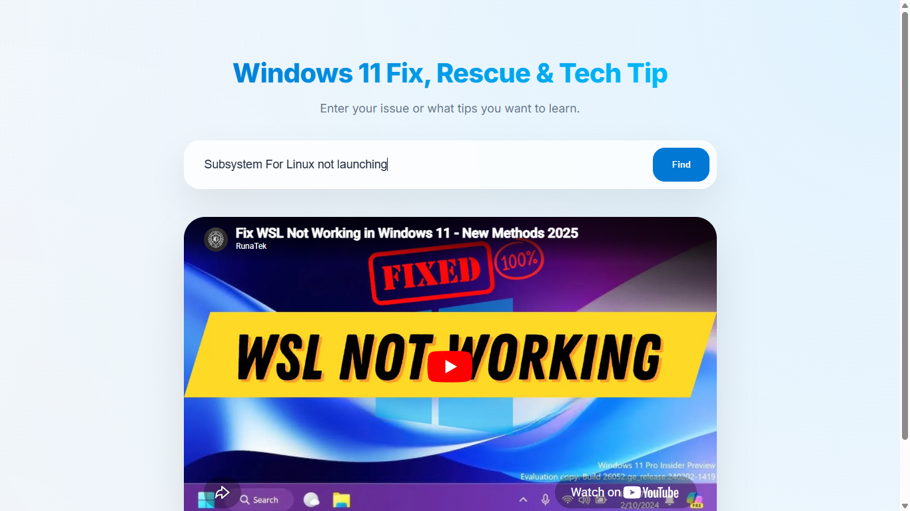
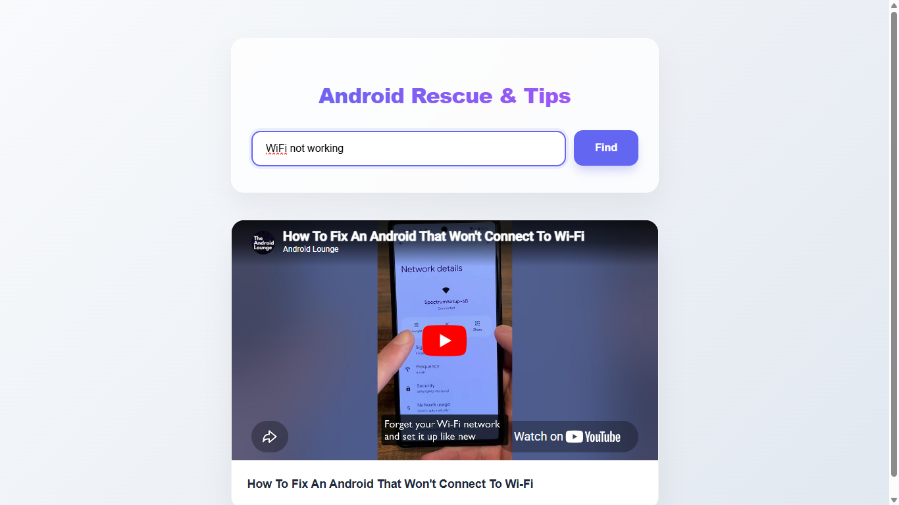

# Win11Fix & AndroidFix🛠️

A fully open-source Graphical User Interface (GUI) web tool that guide you to fix your Windows 11 computer / android smartphone. 

## 🚀 Features
* **Natural Language Guidance:** Clear, easy-to-follow instructions—no advanced technical knowledge required.
* **One-Click Solutions:** Direct links to Windows / Android settings and built-in troubleshooters.
* **System Optimization:** Helpful tips to improve performance and remove bloatware.
* **Portable & Web-Based:** Run the guide directly in your browser without installing heavy software.

## 🛠 Installation (For Windows 11 User)
If you want to run Win11Fix & AndroidFix locally:
1. Clone the repo: `git clone https://github.com/ship-it-afk/win11fix.git`
2. Open `index.html` (Win11Fix) or `androidfix.html` (AndroidFix) in your browser (or run `npm install` if you have dependencies).

## 📖 How to Use
1. Launch the Tool: Open the hosted link for Win11Fix (https://ship-it-afk.github.io/AWC) / AndroidFix (https://ship-it-afk.github.io/AWC/androidfix) or your local index.html (Win11Fix) / androidfix.html (AndroidFix).
2. Identify the Issue: Identify your Windows 11 machine issue (eg. BSOD, Easily Crash, etc) or Android issue (eg. WiFi missing, etc). 
3. Type issue in natural language. 
4. Follow the Steps: Use the interactive guide and apply fixes to your Windows 11 or Android system.

## 🤝 Contributing
We love help! Whether it's fixing a typo or adding a new troubleshooting guide for a Windows update bug or a Android update bug, feel free to fork the repo and submit a pull request.

## 📄 License
This project is licensed under the MIT License.
